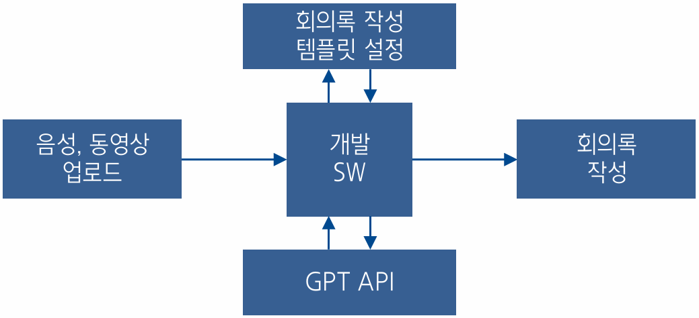

# 3.1 회의록 요약봇 만들기

### 작성: 김범준 강사(comstudian@gmail.com)

소스코드: [https://github.com/comstudynews/meeting-minutes-bot](https://github.com/comstudynews/meeting-minutes-bot)

# 3.1.1 요구 사항과 처리 흐름

① 음성 파일 또는 동영상 파일을 업로드합니다.

② 파일이 길면 적당한 크기로 분할합니다. 분할 도구로 moviepy와 ffmpeg를 사용합니다.

③ Whisper API로 분할된 파일을 음성 인식하여 텍스트를 추출합니다. (STT)

④ 추출된 텍스트를 입력으로 하여 회의록 템플릿에 맞게 요약 결과를 생성합니다.



## moviepy 및 ffmpeg

너무 긴 음성이나 동영상 파일을 자르기 위한 용도로 moviepy를 사용함

① MoviePy 홈페이지: [https://zulko.github.io/moviepy/index.html](https://zulko.github.io/moviepy/index.html)

② MoviePy 참고 서적: [https://wikidocs.net/226777](https://wikidocs.net/226777)

③ 사전 설치: ffmpeg ([https://ffmpeg.org](https://ffmpeg.org/) 참고)


## 회의록 요약봇 시나리오

①  회의록 음성 파일이나 동영상 파일을 업로드함 (Streamlit으로 화면 구현)

② 파일을 적당한 크기로 분할하고, Whisper를 이용해 글자를 추출함 (moviepy, ffmpeg, STT)

③ 추출된 문자열을 기반으로 LLM을 이용해 회의록을 작성함 (추출된 STT로 프롬프트 작성)

## ffmpeg 및 MoviePy 설치하기

가상환경(venv, conda 등) 사용을 권장합니다. ffmpeg를 먼저 설치 후 moviepy 설치 순서 권장. ffmpeg은 MoviePy의 엔진입니다. (MacOS 또는 Windows 환경에도 ffmepg 설치 가능)

참고: [https://zulko.github.io/moviepy/getting_started/install.html](https://zulko.github.io/moviepy/getting_started/install.html)

### Ubuntu / Linux 환경에서 ffmpeg 설치

```bash
sudo apt update
sudo apt install ffmpeg

# 설치 확인
ffmpeg -version

```

## venv 가상 환경에 MoviePy 설치

### (1) pip 사용 (권장)

```bash
# 최신 버전 설치
pip install moviepy --upgrade

# 1.x 버전으로 설치 해야 할 경우 다음 처럼 설치
pip uninstall moviepy -y
pip install "moviepy<2.0"

```

### 설치 확인

`python -c`는 파이썬 파일 없이, 전달된 문자열을 즉시 실행하는 옵션이다. (command string)

```python
# 2.x 설치 확인 테스트 명령
python -c "from moviepy.video.io.VideoFileClip import VideoFileClip; print('MoviePy OK')"

# 참고: 1.x 설치 확인 테스트 명령
python -c "from moviepy.editor import VideoFileClip; print('MoviePy OK')"

```

실행 결과

```bash
ileClip; print('MoviePy OK')"
MoviePy OK
```

① 에러 없이 실행되면 정상 설치입니다.

② ffmpeg 미설치 시 동영상 처리 단계에서 오류가 발생합니다.

---

### MoviePy는 언제 필요할까?

① MoviePy는 **Python으로 영상 편집을 자동화**해야 할 때 적합합니다. 다수의 영상을 복잡하게 조합하거나, 웹 서버 환경(Django, Flask 등)에서 영상·GIF 생성을 자동화하고, 자막·크레딧·컷 편집 같은 반복 작업을 코드로 처리하는 데 유용합니다. 또한 다른 파이썬 라이브러리로 생성한 이미지(Matplotlib 등)로 **애니메이션을 만드는 경우**에도 적합합니다.

② MoviePy가 **최적의 선택이 아닌 경우**도 명확합니다. 프레임 단위의 정밀한 영상 분석(얼굴 인식 등)은 imageio, OpenCV, SimpleCV 같은 전용 라이브러리가 더 적합합니다. 단순 포맷 변환이나 이미지 시퀀스를 영상으로 만드는 작업은 ffmpeg(또는 avconv, mencoder)를 직접 사용하는 편이 **속도와 메모리 효율**이 더 좋습니다.

③ MoviePy의 **장점과 한계**는 다음과 같습니다. 장점은 문법이 단순하고 직관적이며, 한 줄 코드로 기본 작업이 가능해 **입문자에게 이해와 학습이 쉽다**는 점입니다. 반면, 고성능·저수준 처리에는 전문 도구가 더 적합하다는 한계가 있습니다.

즉, **MoviePy는 자동화·조합 중심의 영상 편집에 강점**, **정밀 분석·단순 변환에는 다른 도구가 적합**합니다.

### MoviePy를 활용한 동영상 부분 편집 및 자막 오버레이 예제

```python
# 동영상 편집에 필요한 모든 MoviePy 모듈을 불러온다
# 1.x용
# from moviepy.editor import *
from moviepy.video.io.VideoFileClip import VideoFileClip

# myHolidays.mp4 파일을 불러오고 00:00:50 ~ 00:00:60 구간만 잘라낸다
clip = VideoFileClip("myHolidays.mp4").subclip(50, 60)

# 오디오 볼륨을 0.8배로 줄인다
clip = clip.volumex(0.8)

# 텍스트 클립을 생성한다 (글꼴, 색상 등은 필요에 따라 변경 가능)
txt_clip = TextClip("My Holidays 2013", fontsize=70, color='white')

# 텍스트를 화면 중앙에 10초 동안 표시하도록 설정한다
txt_clip = txt_clip.set_pos('center').set_duration(10)

# 원본 동영상 위에 텍스트 클립을 합성한다
video = CompositeVideoClip([clip, txt_clip])

# 결과 영상을 파일로 저장한다 (다양한 옵션 설정 가능)
video.write_videofile("myHolidays_edited.webm")
```


---

# 3.1.2 프로젝트 폴더 구조

① 한 번에 실행 가능한 최소 구조를 기준으로 구성합니다.

② 업로드/분할/STT/요약을 분리하여 디버깅이 쉬운 형태로 구성합니다.

```
meeting-minutes-bot/
  .venv
  app.py
  .env
  requirements.txt
  data/
    uploads/
    chunks/
    outputs/
  src/
    media.py
    stt.py
    summarize.py
    templates.py

```

## 3.1.3 개발 환경 준비

### (1) 파이썬 가상환경 생성 및 라이브러리 설치

① 가상환경 생성 및 활성화 후 패키지를 설치합니다.

```bash
# macOS/Linux
python3 -m venv .venv
source .venv/bin/activate

# Windows
.venv\Scripts\activate

pip install -U pip
pip install -qU openai python-dotenv moviepy pydub
pip install -qU langchain langchain-community streamlit

```

② requirements.txt를 생성합니다.

```bash
pip freeze > requirements.txt

```

### (2) ffmpeg 설치 확인

① ffmpeg는 동영상에서 오디오를 추출하거나, 오디오 변환/분할에 사용합니다.

② 설치 후 다음 명령으로 확인합니다.

```bash
ffmpeg -version

```

## 3.1.4 OpenAI API 키 설정

① .env 파일을 프로젝트 루트에 생성합니다.

② 키는 코드에 직접 넣지 않고 환경 변수로 관리합니다. ([OpenAI 플랫폼](https://platform.openai.com/docs/api-reference/introduction?utm_source=chatgpt.com))

```
OPENAI_API_KEY=여기에_키_입력

```

## 3.1.5 회의록 템플릿 정의

① “회의록 작성 템플릿 설정” 단계는 입력 텍스트를 어떤 형식으로 구조화할지 정하는 단계입니다.

② 최소 구현에서는 아래 JSON 형식을 권장합니다.

`src/templates.py`

```python
from __future__ import annotations

MINUTES_SYSTEM = """
당신은 회의록 작성 도우미입니다.
출력은 반드시 JSON 객체 한 개만 반환합니다.
아래 스키마의 키 이름을 절대 변경하지 않습니다.
코드블록을 사용하지 않습니다.
"""

MINUTES_USER = """
다음 전사문을 바탕으로 회의록을 JSON으로 정리하세요.

반드시 아래 키만 사용하세요(추가/변경 금지).
{{ 
  "title": "회의 제목(추정 가능)",
  "date": null,
  "participants": [],
  "summary": [],
  "decisions": [],
  "action_items": [
    {{ "owner": null, "task": "", "due": null }}
  ],
  "issues": [],
  "notes": []
}}

작성 규칙:
1. date는 알 수 없으면 null입니다.
2. summary, decisions, issues, notes는 문장 배열입니다.
3. participants는 이름/역할을 알 수 없으면 빈 배열입니다.
4. action_items는 없으면 빈 배열입니다.

전사문:
{transcript}
"""
```

## 3.1.6 동영상/오디오 전처리(분할) 구현

① 업로드된 파일이 길면 토큰/시간 비용이 커지므로 분할이 필요합니다.

② 여기서는 “오디오로 통일 → N초 단위 분할”로 단순화합니다.

`src/media.py`

```python
from __future__ import annotations
from pathlib import Path
from typing import List

from moviepy import VideoFileClip, AudioFileClip
from pydub import AudioSegment

def ensure_dirs(*dirs: Path) -> None:
    for d in dirs:
        d.mkdir(parents=True, exist_ok=True)

def to_wav_16k_mono(src: Path, wav_path: Path) -> None:
    src_str = str(src)

    if src.suffix.lower() in {".mp4", ".mov", ".mkv", ".avi", ".webm"}:
        clip = VideoFileClip(src_str)
        audio = clip.audio
    else:
        clip = None
        audio = AudioFileClip(src_str)

    wav_path.parent.mkdir(parents=True, exist_ok=True)

    audio.write_audiofile(
        str(wav_path),
        fps=16000,
        codec="pcm_s16le",
        ffmpeg_params=["-ac", "1"],
        logger=None,
    )

    audio.close()
    if clip is not None:
        clip.close()

def split_wav(wav_path: Path, chunk_seconds: int, out_dir: Path) -> List[Path]:
    out_dir.mkdir(parents=True, exist_ok=True)

    audio = AudioSegment.from_wav(str(wav_path))
    chunk_ms = chunk_seconds * 1000

    chunks: List[Path] = []
    total_ms = len(audio)

    idx = 0
    for start in range(0, total_ms, chunk_ms):
        end = min(start + chunk_ms, total_ms)
        piece = audio[start:end]

        out_path = out_dir / f"{wav_path.stem}_{idx:04d}.wav"
        piece.export(str(out_path), format="wav")
        chunks.append(out_path)
        idx += 1

    return chunks

```

# 3.1.7 Whisper로 텍스트 추출 구현

Whisper 공식 레파지토리: [https://github.com/openai/whisper](https://github.com/openai/whisper)

① 슬라이드의 “Whisper를 이용해 글자를 추출함” 단계입니다.

② OpenAI 오디오 가이드를 따라 음성 인식을 수행합니다.

OpenAI 플래폼: [https://platform.openai.com/docs/guides/audio?utm_source=chatgpt.com](https://platform.openai.com/docs/guides/audio?utm_source=chatgpt.com)

## **OpenAI Whisper API를 이용한 STT 실행 예제**

이 코드는 OpenAI Whisper API를 이용해 음성 파일을 서버로 전송하고, 음성 인식 결과를 텍스트로 받아오는 가장 단순한 STT 실행 예제입니다.  (VS-Code 가상 환경 테스트 가능 - 회의록 작성의 핵심 기능)

참고: [https://platform.openai.com/docs/guides/speech-to-text](https://platform.openai.com/docs/guides/speech-to-text)

```python
# OpenAI Python SDK에서 OpenAI 클라이언트 클래스를 불러온다
from openai import OpenAI

# OpenAI API와 통신하기 위한 클라이언트 객체를 생성한다
# (환경 변수 OPENAI_API_KEY를 자동으로 사용함)
client = OpenAI()

# 텍스트로 변환할 오디오 파일을 바이너리 읽기 모드(rb)로 연다
# Whisper API는 파일 객체를 직접 입력으로 받는다
audio_file = open("/path/to/file/audio.mp3", "rb")

# 음성 인식(STT) 요청을 수행한다
# model="whisper-1"은 OpenAI에서 제공하는 Whisper 기반 음성 인식 모델이다
# file 인자로 전달된 오디오 파일을 텍스트로 변환한다
transcription = client.audio.transcriptions.create(
    model="whisper-1",
    file=audio_file
)

# 변환된 음성 인식 결과 중 순수 텍스트(text)만 출력한다
print(transcription.text)

# 기본 응답 형식은 JSON이며, 변환된 원본 텍스트가 포함된다

```

---

`src/stt.py`

```python
from __future__ import annotations
from pathlib import Path
from typing import List

from openai import OpenAI

def transcribe_files(files: List[Path], language: str = "ko") -> str:
    client = OpenAI()
    texts: List[str] = []

    for f in files:
        with open(f, "rb") as audio_fp:
            # 모델/파라미터는 조직 정책과 가용 모델에 따라 조정합니다.
            # 오디오 관련 사용법은 OpenAI Audio 가이드를 기준으로 합니다.
            # https://platform.openai.com/docs/guides/audio
            result = client.audio.transcriptions.create(
                model="gpt-4o-mini-transcribe",
                file=audio_fp,
                language=language,
            )
        texts.append(result.text)

    return "\n".join(texts)

```

# 3.1.8 회의록 요약 생성 구현

① 슬라이드의 “추출된 문자열을 기반으로 LLM을 이용해 회의록을 작성함” 단계입니다.

② 신규 프로젝트는 Responses API 사용을 권장하는 문서를 기준으로 작성합니다. ([OpenAI 플랫폼](https://platform.openai.com/docs/api-reference/responses?utm_source=chatgpt.com))

`src/summarize.py`

```python
from __future__ import annotations
import json
from typing import Any

from openai import OpenAI
from src.templates import MINUTES_SYSTEM, MINUTES_USER

def normalize_minutes(m: dict[str, Any]) -> dict[str, Any]:
    # 키 흔들림 흡수
    if "participants" not in m and "attendees" in m:
        m["participants"] = m.pop("attendees")
    if "issues" not in m and "risks" in m:
        m["issues"] = m.pop("risks")
    if "notes" in m and isinstance(m["notes"], str):
        m["notes"] = [m["notes"]]

    # summary 문자열 → 리스트 변환
    if "summary" in m and isinstance(m["summary"], str):
        m["summary"] = [m["summary"]]

    # 누락 키 기본값 보정
    m.setdefault("title", "회의록")
    m.setdefault("date", None)
    m.setdefault("participants", [])
    m.setdefault("summary", [])
    m.setdefault("decisions", [])
    m.setdefault("action_items", [])
    m.setdefault("issues", [])
    m.setdefault("notes", [])

    return m

def summarize_minutes(transcript: str) -> dict[str, Any]:
    client = OpenAI()

    prompt = MINUTES_USER.format(transcript=transcript)

    resp = client.chat.completions.create(
        model="gpt-4o-mini",
        temperature=0.2,
        messages=[
            {"role": "system", "content": MINUTES_SYSTEM.strip()},
            {"role": "user", "content": prompt.strip()},
        ],
    )

    text = resp.choices[0].message.content.strip()

    # ① GPT 응답을 JSON으로 파싱
    minutes = json.loads(text)

    # ② 여기서 반드시 정규화 한 번 거쳐서 반환
    return normalize_minutes(minutes)

```

# 3.1.9 실행용 메인 프로그램

① 업로드 파일 1개를 입력받아 결과 JSON을 저장합니다.

② 최소 구현 기준으로 CLI 형태로 구성합니다.

`app.py`

```python
from __future__ import annotations
import json
from pathlib import Path
from dotenv import load_dotenv

from src.media import ensure_dirs, to_wav_16k_mono, split_wav
from src.stt import transcribe_files
from src.summarize import summarize_minutes

def main() -> None:
    load_dotenv()

    base = Path(__file__).parent
    uploads = base / "data" / "uploads"
    chunks_dir = base / "data" / "chunks"
    outputs = base / "data" / "outputs"
    ensure_dirs(uploads, chunks_dir, outputs)

    file_path_str = input("업로드 파일 경로(음성/동영상)를 입력하세요: ").strip()
    src = Path(file_path_str)

    if not src.exists():
        raise FileNotFoundError(f"파일이 없습니다: {src}")

    wav_path = uploads / f"{src.stem}.wav"
    to_wav_16k_mono(src, wav_path)

    chunk_seconds = 60
    chunks = split_wav(wav_path, chunk_seconds=chunk_seconds, out_dir=chunks_dir)

    transcript = transcribe_files(chunks, language="ko")
    minutes = summarize_minutes(transcript)

    out_file = outputs / f"{src.stem}_minutes.json"
    out_file.write_text(json.dumps(minutes, ensure_ascii=False, indent=2), encoding="utf-8")

    print(f"완료: {out_file}")

if __name__ == "__main__":
    main()

```

# 3.1.10 실행 방법

① 프로젝트 루트에서 실행합니다.

```bash
python app.py

```

② “업로드 파일 경로”에 mp3/mp4 등 파일 경로를 입력합니다.

③ 결과는 `data/outputs/*.json`으로 저장됩니다.

---

# 3.1.11 회의록 템플릿 프롬프트

## 1. 설계 원칙

① 회의 목적·참석자·액션아이템은 **추측 최소화 + 규칙 기반 추론**만 허용합니다.

② 불확실한 정보는 임의 생성하지 않고 `null` 또는 `"알 수 없음"`으로 처리합니다.

③ 출력 형식은 **JSON 단일 객체**로 고정합니다.

④ 교육 과정용이므로 **구조 안정성·재현성**을 최우선으로 합니다.

---

## 2. 회의록 작성 규칙(LLM 시스템 지침)

아래 내용은 **System Prompt**로 사용됩니다.

```
당신은 IT·AI 교육 과정에서 사용되는 회의록 작성 전용 AI입니다.
다음 규칙을 반드시 지켜 회의록을 작성하십시오.

[공통 규칙]
- 출력은 반드시 JSON 형식 단일 객체로만 작성하십시오.
- JSON 외의 설명 문장, 마크다운, 코드블록을 절대 출력하지 마십시오.
- 녹취 텍스트에 없는 사실을 추측하거나 만들어내지 마십시오.
- 불확실한 정보는 null 또는 "알 수 없음"으로 처리하십시오.

[회의 목적(title) 규칙]
- 회의 목적은 회의 전체를 가장 잘 대표하는 한 문장으로 작성하십시오.
- 회의 목적은 “~관련 회의”, “~논의 회의”, “~진행 회의” 형태를 우선 사용하십시오.
- 목적이 명확하지 않으면 "회의 목적 불명확"으로 작성하십시오.

[회의 일자(date) 규칙]
- 녹취에 명확한 날짜가 언급된 경우 YYYY-MM-DD 형식으로 작성하십시오.
- 날짜 정보가 없으면 null로 처리하십시오.

[참석자(attendees) 추정 규칙]
- 녹취에서 이름, 직책, 호칭이 명확히 언급된 인물만 참석자로 포함하십시오.
- 단순 대명사(“저”, “우리”, “팀”)만 등장하는 경우 참석자를 추정하지 마십시오.
- 이름이 불완전한 경우에도 그대로 기록하고, 추측하여 보완하지 마십시오.
- 참석자 정보가 없으면 빈 배열([])로 처리하십시오.

[안건(agenda) 규칙]
- 회의 중 반복적으로 논의된 주요 주제만 안건으로 정리하십시오.
- 세부 잡담이나 인사말은 안건에서 제외하십시오.
- 안건은 명사형 문장으로 작성하십시오.

[요약(summary) 규칙]
- 회의 전체 흐름을 3~5문장 이내로 요약하십시오.
- 결정 이전 논의 과정과 결론을 구분하여 서술하십시오.
- 개인 의견이 아닌 회의 차원의 내용만 반영하십시오.

[결정사항(decisions) 규칙]
- “결정”, “확정”, “하기로 했다”, “진행한다” 등 명확한 표현이 있는 경우만 포함하십시오.
- 논의만 되었고 결론이 없는 내용은 포함하지 마십시오.
- 결정사항이 없으면 빈 배열([])로 처리하십시오.

[액션 아이템(action_items) 규칙]
- 실행 주체(owner)가 명확히 언급된 경우에만 액션 아이템으로 포함하십시오.
- 담당자가 언급되지 않은 경우 owner는 "미정"으로 작성하십시오.
- 할 일(task)은 구체적인 행동 단위로 작성하십시오.
- 마감일이 없으면 due는 null로 처리하십시오.

[리스크(risks) 규칙]
- 일정 지연, 기술적 문제, 의사결정 보류 등 잠재적 위험만 포함하십시오.
- 단순 우려 수준은 포함하지 마십시오.
- 리스크가 없으면 빈 배열([])로 처리하십시오.

[비고(notes) 규칙]
- 기타 회의 특이사항, 추후 논의 필요 사항만 간략히 기록하십시오.
- 중복 내용은 작성하지 마십시오.

```

---

## 3. 출력 JSON 스키마 (고정)

```json
{
  "title": "회의 제목",
  "date": "YYYY-MM-DD 또는 null",
  "attendees": ["참석자1", "참석자2"],
  "agenda": ["안건1", "안건2"],
  "summary": "회의 전체 요약",
  "decisions": ["결정사항1", "결정사항2"],
  "action_items": [
    {
      "owner": "담당자 또는 미정",
      "task": "할 일",
      "due": "마감일 또는 null"
    }
  ],
  "risks": ["리스크1"],
  "notes": "추가 메모 또는 null"
}

```

---

## 4. `src/templates.py` 최종 적용 예시

```python
MEETING_MINUTES_SCHEMA = """
[System Instruction]

(위 규칙 전문 그대로 삽입)

"""

```

---

# 3.1.12 참고 문헌 및 도구 URL

① MoviePy 공식: [https://zulko.github.io/moviepy/index.html](https://zulko.github.io/moviepy/index.html)

② MoviePy 참고: [https://wikidocs.net/226777](https://wikidocs.net/226777)

③ FFmpeg: [https://ffmpeg.org](https://ffmpeg.org/)

④ OpenAI API 문서(개요): [https://platform.openai.com/docs/overview](https://platform.openai.com/docs/overview)

⑤ OpenAI Audio 가이드: [https://platform.openai.com/docs/guides/audio](https://platform.openai.com/docs/guides/audio) 

⑥ OpenAI Responses API: [https://platform.openai.com/docs/api-reference/responses](https://platform.openai.com/docs/api-reference/responses) 

---

[[미니] 회의록 요약봇 구현](https://app.notion.com/p/843f617e78e382d3947c0176c2c03d3f?pvs=21)

[파이썬 단위 테스트(Unit Test)](https://app.notion.com/p/Unit-Test-18ef617e78e382e5b1d301728b923eae?pvs=21)

[VirtualBox 공유 폴더 + Guest Additions 설치](https://app.notion.com/p/VirtualBox-Guest-Additions-a7af617e78e38304987601e6e35046da?pvs=21)